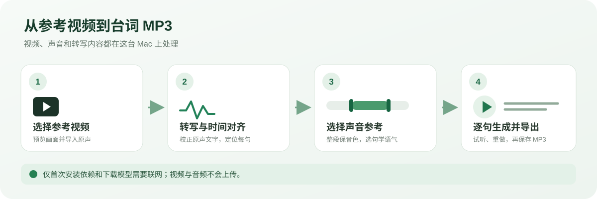
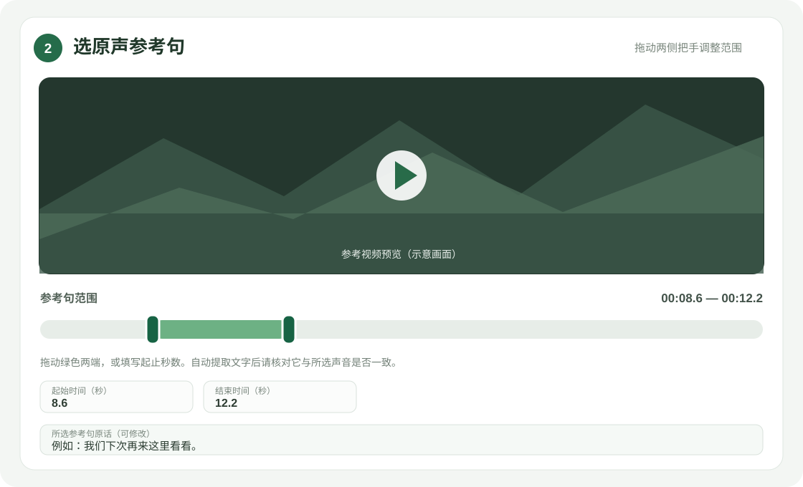
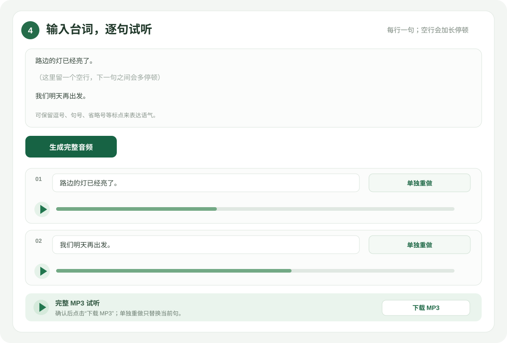

# 本机台词配音工具

在 Apple Silicon Mac 上，用参考视频里的声音生成新的台词音频。工具会保留整段原声作为音色、口音参考，并把你选中的原句作为语气和停顿参考，最后导出 MP3；不会生成或修改视频。

> 视频、音频和识别内容都在本机处理。首次安装依赖和模型时需要联网下载；下载完成后，日常转写与配音在本机运行。



## 功能一览

- 导入 MP4、MOV、M4V、MKV 或 WebM 视频，最大 2 GB。
- 用本机 Qwen3-ASR 识别台词，并用 ForcedAligner 对齐时间；识别结果可以修改。
- 预览视频并拖动时间轴，选取要模仿语气的原声片段。
- 用整段原声参考音色和口音，用选中片段额外参考语气与停顿。
- 每行生成一句；空一行会增加句间停顿。可试听完整音频或单句，也能单独重做某一句。
- 导出单个 MP3 到工具的 `outputs/` 文件夹。

## 系统要求

- Apple Silicon Mac 和 macOS。
- Python 3.12（启动器会通过 `uv` 管理独立环境）。
- `uv` 与 FFmpeg。若已安装 Homebrew，可在“终端”运行：

  ```bash
  brew install uv ffmpeg
  ```

- 如果还没有 Homebrew，请先按 [Homebrew 官方说明](https://brew.sh/)安装。
- 首次准备依赖和模型时建议至少预留 12 GB 磁盘空间，并保持网络连接。模型下载完成后无需重复下载。

## 安装与启动

### 从 GitHub 获取项目

```bash
git clone https://github.com/JasirVoriya/local-dialogue-voice.git
cd local-dialogue-voice
chmod +x 启动.command
```

也可以在 GitHub 仓库页面下载 ZIP 并解压。若启动文件无法双击，在项目目录打开“终端”运行上面的 `chmod` 命令。

### 启动网页

在 Finder 中双击 `启动.command`。如果 macOS 阻止首次打开，可在 Finder 中右键该文件，选择“打开”，并确认你获取的是本项目文件。也可以在项目目录的“终端”运行：

```bash
./启动.command
```

启动器会安装缺少的 Python 依赖并自动打开浏览器。首次启动时请保持终端窗口打开；关闭运行中的终端会停止本机网页服务。服务只监听 `127.0.0.1`，可在终端按 `Control-C` 停止。

### 首次下载模型

第一次点击“识别视频台词”时，工具会下载 ASR 和时间对齐模型；第一次点击“生成完整音频”时，会下载声音生成模型。下载进度会显示在网页中。若下载中断，检查网络和磁盘空间后重新操作即可，已经完整下载的模型会保留在本机。

模型与临时任务数据保存在：

```text
~/Library/Application Support/TaiCiPeiyin/
```

## 使用步骤

### 1. 导入参考视频

在网页的“选择参考视频”区域点选视频，或把视频拖进页面。导入后页面会显示视频预览和时长。视频副本保存在本机应用数据目录中，不会发送到云端。

### 2. 识别原声台词

点击“识别视频台词”，等待转写与时间对齐完成。首次运行此步骤会下载本机转写模型。识别结束后，整段转写会显示在“校对原声文字”区域。

检查方言、姓名、地名和标点。ASR 可能听错专名或口音较重的词，可以直接修改转写文字。

### 3. 选择要模仿的原声句

视频下方的时间轴绿色区域是语气参考片段。拖动左右把手调整起点和终点，也可以在视频播放到相应位置后点击“从播放位置设起点”或“从播放位置设终点”，或直接填写秒数。

识别结果会按时间范围自动提取到“所选参考句原话”文本框。核对这句话是否和绿色范围内的声音一致；如果识别文字有误，可以在文本框里手动修改。之后拖动时间轴时，点击“按当前时间范围重新提取原话”可重新同步。



### 4. 输入新台词并生成

在“输入要生成的台词”区域粘贴内容：**每行一句**。空一行会让下一句前的停顿更长。建议按自然说话的句子分行，并保留逗号、句号、省略号等标点。

点击“生成完整音频”后，工具会按行合成并在末尾合并停顿。第一次生成时还会下载本机声音生成模型。

### 5. 试听、重做和下载

- 用每句下方的播放器试听单句，用“完整 MP3 试听”播放器听整段。
- 如果只需修改一句，编辑该句的文本框，再点旁边的“单独重做”。其他句子的音频和顺序会保留。
- 确认后点“下载 MP3”。文件默认保存在项目目录的 `outputs/`。



### 6. 清理项目

“清理当前项目”会删除本次导入的视频副本、提取的临时音频、分句音频和本次 MP3。**清理前请先下载或复制要保留的 MP3。**清理后可重新导入另一段视频。

## 常见问题

### 启动时提示找不到 `uv` 或 FFmpeg

安装缺少的工具后再双击启动。使用 Homebrew 时可运行：

```bash
brew install uv ffmpeg
```

### 模型下载失败或长时间没有进度

首次下载需要稳定网络和足够磁盘空间。检查网络连接后重试；下载完成的模型会保留，不必从头重复下载。模型下载来源为 [ModelScope](https://modelscope.cn/)；视频、音频不会随模型请求上传。

### 转写文字不准确，或参考句没有自动填入

先检查并修改整段原声转写，再检查“所选参考句原话”。如果没有可用的自动时间对齐，仍可拖选视频时间范围并手动填写参考句文字。

### 生成声音和原声差异较大

尽量选择说话清楚、背景音乐和噪声较少的视频；校对整段转写与参考句文字。实际音色、口音和语气相似度会受参考录音质量和模型效果影响，不能保证逐音节完全一致。

### 关闭网页后如何继续

最近一次项目会保存在本机。重新双击启动器并打开网页后，工具会尝试恢复最近项目。需要更换视频时，可清理当前项目后重新导入。

## 隐私与本机存储

- 网页服务绑定 `127.0.0.1`，只允许本机访问。
- 视频、提取的原声、转写、逐句音频和 MP3 都在本机文件系统中处理与保存。
- 首次运行会联网下载依赖及模型；之后模型从本机缓存加载。
- 本仓库只包含工具源码、依赖锁定文件、说明与示意图；虚拟环境和生成媒体不提交到 GitHub。

## 使用的模型

- [Qwen3-ASR](https://github.com/QwenLM/Qwen3-ASR)：语音识别和时间戳相关能力。
- [Qwen3-TTS](https://github.com/QwenLM/Qwen3-TTS)：基于参考音频与对应文字的声音克隆生成。
